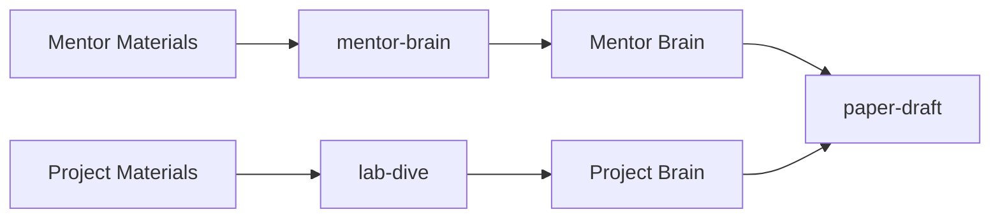
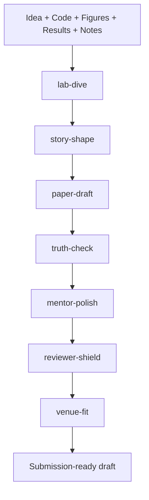
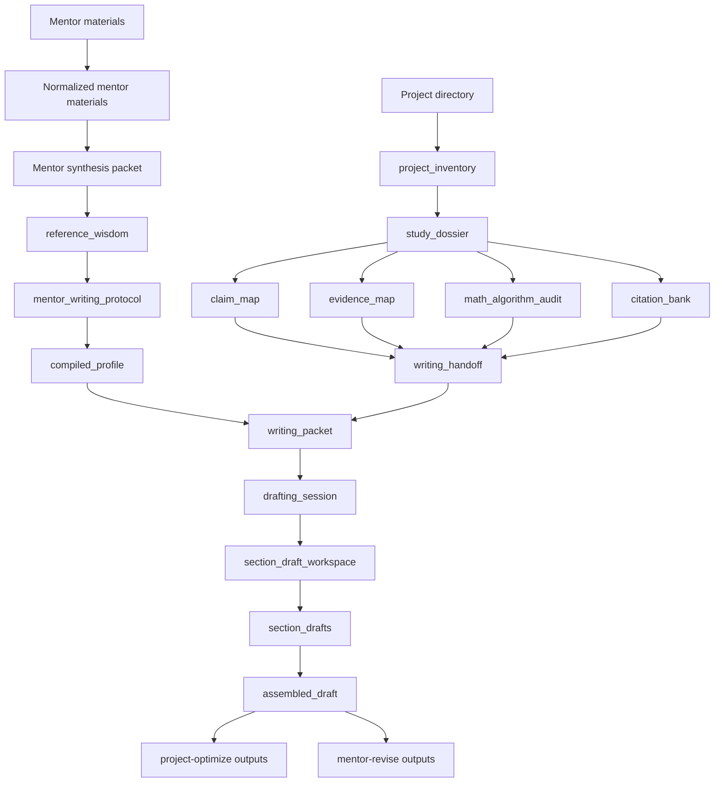

# Codex Paper Skills v0.0.1 Master Architecture Design

Status: approved architecture freeze candidate
Audience: project owner, Codex operators, future implementers
Scope: architecture only; this document intentionally freezes major workflow boundaries before further feature work

---

## 1. Why this document exists

The repository already has many useful capabilities, but the product risk is now architectural drift rather than lack of features.

The system must stop growing sideways and instead converge on a coherent operating model.

This document defines that model.

The goal is not merely to create an AI writing tool. The goal is to create a **mentor-guided, project-aware, professor-grade academic writing operating system for Codex**.

That means the system must simultaneously:

1. learn mentor writing intelligence from trusted mentor materials,
2. study the current research project deeply and rigorously,
3. convert mentor brain plus project brain into draftable paper structure,
4. optimize scientific correctness before stylistic polish,
5. revise language toward mentor-level quality,
6. expose every important intermediate artifact so the workflow remains inspectable, debuggable, and improvable.

---

## 1A. Current scope freeze: PolyU AAE IPNL only

For v0.0.1, this package is **not** a general academic writing system.

It should be treated as a lab-specific writing operating system for the **Intelligent Positioning and Navigation Laboratory (IPNL)** in the Department of Aeronautical and Aviation Engineering at The Hong Kong Polytechnic University.

### Why this matters

The architecture must be designed around the actual lab domain instead of pretending to be domain-agnostic too early.

### Official lab context we should align to

From the PolyU AAE IPNL pages and faculty pages, the lab and its research line emphasize:

- intelligent positioning and navigation,
- GNSS positioning and signal processing,
- multi-sensor integration,
- autonomous driving and UAV-related navigation,
- indoor positioning,
- smart mobility and smart-city positioning,
- visual / LiDAR SLAM,
- estimation and optimization,
- positioning integrity and reliability.

Current product scope should therefore remain centered on:

- GNSS,
- integrated navigation,
- factor graph optimization,
- uncertainty / integrity / credibility,
- sensor fusion,
- SLAM-adjacent positioning pipelines,
- AI / deep learning methods when they serve the above positioning-and-navigation problems.

This scope freeze does **not** prohibit future expansion, but it prevents premature generalization.

---

## 1B. Proposed product-facing naming refresh

The current repo/package names are useful historical labels, but they are not the clearest user-facing names.

For the architecture and future user workflow, the recommended public naming system should become:

- **Product name:** `IPNL Paper Pilot`
- **Current compatibility aliases:** `codex-paper-skills`, `codex-paper-forge`

The phrase “Paper Pilot” is intentionally a little lighter and more memorable, while still fitting the AAE / navigation context.

---

## 2. Non-negotiable design principles

### 2.1 Skills are guides; Codex is the executor

Every skill in this package is a guidance surface, not the real worker.

- **Skills** define workflow, guardrails, done criteria, and routing.
- **Codex / agents** perform the real thinking, synthesis, drafting, and revision.
- **Scripts** provide stable deterministic scaffolding, artifact generation, serialization, and verification.

The package exists to push Codex to work correctly, thoroughly, and consistently — not to replace Codex with scripts.

### 2.2 Mentor brain and project brain must remain separate

The system needs two different brains.

- **Mentor Brain** = how the mentor writes, judges, organizes, tightens, and revises.
- **Project Brain** = what the current research project actually claims, supports, lacks, risks, and should cite.

If these are mixed, the system becomes confused and eventually degrades.

### 2.3 Active drafts must never contaminate mentor learning

Current project drafts are targets for writing and revision. They are **not** valid mentor/reference wisdom sources.

This is a hard guardrail.

### 2.4 Scientific correctness comes before mentor-style polish

A polished but scientifically weak paper is still weak.

Therefore the workflow must enforce:

1. study and verify the project,
2. write the paper,
3. optimize scientific correctness,
4. only then perform mentor-style revision polish.

### 2.5 Evidence before elegance

The system must prefer:

- evidence over fluency,
- explicit support over elegant bluffing,
- verifiable claims over impressive wording,
- named comparators over vague improvement language,
- honest scope limits over inflated conclusions.

### 2.6 Architecture must remain inspectable

Every important intermediate stage should produce visible artifacts.

This is required for:

- debugging,
- quality review,
- version tracking,
- skill evolution,
- future agent routing.

---

## 3. Professor-grade target capabilities

A genuinely excellent research professor is not just a better sentence editor.

The target system must eventually support the following professor-level capabilities:

| Capability | Why it matters | Primary lane |
|---|---|---|
| Mentor writing intelligence | Makes Codex write and revise like the mentor | `mentor-brain` |
| Deep project understanding | Prevents shallow writing disconnected from the real work | `lab-dive` |
| Framing and positioning | Chooses the strongest paper angle and scientific gap | `story-shape` |
| Research value ranking | Separates main-text evidence from filler | `lab-dive` + `story-shape` |
| Math / algorithm rigor | Protects formulas, notation, theory, and method honesty | `lab-dive` + `truth-check` |
| Citation strategy | Ensures references are real, high-quality, and purposefully placed | `lab-dive` + `story-shape` |
| Evidence / claim alignment | Prevents overclaim and weak argument chains | `truth-check` |
| Mentor-level language revision | Produces mentor-grade local writing quality | `mentor-polish` |
| Reviewer attack awareness | Anticipates reviewer objections before submission | `reviewer-shield` |
| Student rescue / bottleneck diagnosis | Helps the user know whether to write, rethink, or run more experiments | `lab-dive` + `story-shape` |
| Scope control | Decides what belongs in this paper versus another one | `story-shape` |

The current repository has partially entered this space, but v0.0.1 should explicitly encode these responsibilities instead of leaving them implicit.

---

## 3A. External professor-grade writing guidance we should borrow

The pipeline should not rely only on our intuition. It should consciously borrow from strong scientific writing guidance that has already shaped generations of technical researchers.

### Source 1: George M. Whitesides (Harvard Chemistry) — *Writing a Paper*

Useful principles to import:

- writing is part of the research process, not only the reporting phase,
- the paper should be outlined early enough to influence what experiments are still needed,
- the introduction must explain why the work matters, not merely what was done,
- a paper should be engineered around the information the reader needs.

Pipeline implications:

- `lab-dive` must identify missing evidence before `paper-draft`,
- `story-shape` must make “why this matters” explicit,
- `truth-check` should check whether the current experiments are enough for the chosen story.

### Source 2: Donald Knuth (Stanford Computer Science) — technical writing and mathematical writing guidance

Useful principles to import:

- mathematical notation and prose must cooperate instead of fighting each other,
- algorithm explanation is part of technical communication, not decoration,
- revision quality often comes from ruthless clarification, not only compression,
- examples, diagrams, and notation discipline strongly affect whether technical content is truly understandable.

Pipeline implications:

- `math_algorithm_audit` must be a first-class artifact,
- `paper-draft` should treat notation, figures, and algorithm descriptions as coordinated communication,
- `mentor-polish` must fix local wording without breaking mathematical truth.

### Source 3: Simon Peyton Jones — *How to Write a Great Research Paper*

Useful principles to import:

- a paper should have one clear central contribution,
- the paper should tell a coherent story rather than dump results,
- title and abstract are a contract with the reader,
- rewriting and reviewer feedback are integral to the paper process.

Pipeline implications:

- `story-shape` must select the single strongest paper angle,
- `paper-draft` must preserve story coherence section by section,
- `reviewer-shield` should be part of the architecture rather than an afterthought.

### Source 4: Kristin Sainani (Stanford) — scientific writing and publication guidance

Useful principles to import:

- clarity usually improves when clutter is aggressively removed,
- paragraph structure matters as much as sentence correctness,
- figures and tables should show data honestly and directly,
- writing, revision, and publication strategy should be treated as an integrated workflow.

Pipeline implications:

- `mentor-polish` should explicitly target clutter and AI-smooth but low-information prose,
- `paper-xray` should inspect whether tables/figures communicate honestly,
- `truth-check` and `mentor-polish` should remain separate but consecutive.

### Architecture rule derived from these sources

The package should not merely “generate text.” It should embody:

1. early research-aware outlining,
2. single-story framing,
3. notation/algorithm rigor,
4. honest evidence communication,
5. heavy revision as a normal stage rather than a late emergency.

---

## 4. Canonical lane decomposition

The system should now be understood as **seven primary lanes** plus **three support lanes**.

---

### 4.1 Primary lane: `mentor-brain`

Current user-facing name: `mentor-brain`

#### Mission
Learn mentor intelligence from trusted mentor materials only.

#### Inputs
- mentor PDFs
- mentor transcript notes
- transcript JSON records
- revision traces / rewrite examples
- trusted reference papers aligned with the mentor’s research line

#### Outputs
- normalized mentor materials
- mentor synthesis packet
- `reference_wisdom`
- `mentor_writing_protocol`
- `compiled_profile`

#### What it answers
- How does the mentor write?
- How does the mentor structure sections and paragraphs?
- What language does the mentor reject?
- How does the mentor revise and tighten scientific prose?

#### What it must not do
- study the current project directory,
- draft the current paper,
- revise the current student paper as training data.

---

### 4.2 Primary lane: `lab-dive`

Current user-facing name: `lab-dive`

#### Mission
Understand the current research project deeply and turn it into a paper-ready knowledge package.

#### Inputs
- project directory
- code
- figures
- result files
- logs
- notes / idea documents
- optional literature retrieval results
- mentor brain for guidance, not for substitution

#### Outputs
- `project_inventory`
- `study_dossier`
- `claim_map`
- `evidence_map`
- `math_algorithm_audit`
- `citation_bank`
- `writing_handoff`
- `studying_summary`

#### What it answers
- What problem does the current project really solve?
- Which claims are strongest, weakest, risky, or unsupported?
- Which evidence belongs in the main text versus appendix or not at all?
- Which formulas, algorithms, or theoretical claims need verification?
- Which real references must support the paper?

#### What it must not do
- draft the paper before the handoff is credible,
- invent evidence,
- fabricate citations,
- use mentor style as a substitute for project understanding.

---

### 4.3 Primary lane: `story-shape`

Current user-facing name: `story-shape`

#### Mission
Convert project understanding into the strongest paper story, contribution hierarchy, and scope boundary.

#### Inputs
- `study_dossier`
- `claim_map`
- `evidence_map`
- `citation_bank`
- mentor brain

#### Outputs
- framing memo
- paper angle candidates
- contribution hierarchy
- novelty / scope statement
- title candidates
- abstract framing options
- risk register for overclaim or weak novelty

#### What it answers
- What is the strongest scientific framing for this paper?
- Which contribution should be foregrounded?
- What should *not* be claimed?
- What belongs in this paper and what should be deferred?
- Which framing is most robust against reviewer criticism?

#### What it must not do
- replace rigorous studying,
- become a vague brainstorming memo,
- start drafting full prose.

---

### 4.4 Primary lane: `paper-draft`

Current user-facing name: `paper-draft`

#### Mission
Use mentor brain plus project brain to produce section-level and paragraph-level draft outputs.

#### Inputs
- mentor brain
- writing handoff
- framing memo
- venue profile (optional)

#### Outputs
- outline
- skeleton
- paragraph plan
- sentence plan
- writing packet
- drafting session
- section draft workspace
- section drafts
- assembled draft

#### What it answers
- How should the paper be structured?
- What should each section do?
- What should each paragraph do?
- What sentence-level moves are required to make the section defensible and mentor-aligned?

#### What it must not do
- overwrite framing,
- improvise beyond evidence,
- polish unsupported claims into sounding credible.

---

### 4.5 Primary lane: `truth-check`

Current user-facing name: `truth-check`

#### Mission
Optimize an already mostly written draft using project brain and scientific rigor constraints.

#### Inputs
- mature or semi-mature draft
- study dossier
- claim map
- evidence map
- math/algorithm audit
- citation bank

#### Outputs
- scientific issue report
- claim/evidence correction packet
- citation repair plan
- math/algorithm correction notes
- project-level rewrite plan

#### What it answers
- Does the draft say only what the project can support?
- Are math and algorithm descriptions rigorous and consistent?
- Are required citations present and well-placed?
- Which paragraphs are scientifically weak even if they sound fluent?

#### What it must not do
- pretend local prose polish solves scientific weakness,
- replace mentor-style revision,
- treat unsupported claims as acceptable if the wording sounds cautious.

---

### 4.6 Primary lane: `mentor-polish`

Current user-facing name: `mentor-polish`

#### Mission
Revise a scientifically credible draft toward mentor-level writing quality.

#### Inputs
- mature draft after scientific optimization
- mentor brain
- mentor writing protocol

#### Outputs
- mentor revision packet
- sentence-level polish notes
- paragraph-level mentor rewrite notes
- transition and rhythm fixes
- final mentor-style refinement plan

#### What it answers
- How would the mentor tighten this sentence?
- Where is the paragraph rhythm wrong?
- Which transitions are weak, abrupt, or too AI-like?
- What local wording and tone changes are required to match the mentor’s quality bar?

#### What it must not do
- substitute for project correctness,
- approve a scientifically weak draft merely because it sounds polished.

---

### 4.7 Primary lane: `reviewer-shield`

Current user-facing name: `reviewer-shield`

#### Mission
Simulate reviewer attack surfaces before submission.

#### Inputs
- framed paper plan or mature draft
- claim/evidence/citation artifacts
- venue profile

#### Outputs
- reviewer attack-surface memo
- likely major concerns
- missing-baseline warnings
- novelty vulnerability notes
- likely-reject reasons and countermeasures

#### What it answers
- What will reviewers attack first?
- Which claims are too exposed?
- Which references or baselines are conspicuously missing?
- Which extra experiments or wording reductions would most improve survival odds?

#### What it must not do
- replace project optimization,
- become a generic pessimism engine,
- fabricate reviewer demands without evidence.

---

## 5. Support lanes

### 5.1 `paper-xray`
A combined diagnostic surface that aggregates analyzers and packages issues.

### 5.2 `reference-mirror`
A mirror against strong reference papers, useful for paragraph-job and sentence-move comparison.

### 5.3 `venue-fit`
A venue constraint layer that reshapes paper organization and presentation for a target journal or conference.

These are important, but they are not the core authoring lifecycle itself.

---

## 6. The two-brain model

### 6.1 Mentor Brain contains
- mentor reference wisdom
- mentor writing protocol
- section and paragraph decision policies
- local language guardrails
- mentor revision heuristics

### 6.2 Project Brain contains
- inventory of project assets
- project-level claims and evidence structure
- math/algorithm audit
- citation strategy and citation bank
- framing constraints and writing handoff

### 6.3 Why two brains are necessary
Without mentor brain, the paper may be correct but not mentor-level.

Without project brain, the paper may sound strong but rest on shallow understanding.

The system must have both.

---

## 7. End-to-end lifecycle

### Sequence rationale
1. **Study first** so the system knows the project.
2. **Frame second** so the system knows the strongest story.
3. **Draft third** so the prose follows both brains.
4. **Optimize scientifically** before polishing language.
5. **Revise in mentor style** only after correctness is stable.
6. **Simulate reviewer attack** before final venue adaptation.

---

## 8. Artifact flow

---

## 9. Skill vs agent vs script allocation

This is a central architectural boundary.

### 9.1 Skills
Skills are **workflow and governance surfaces**.

They should define:
- when the lane is used,
- what the inputs and outputs are,
- which guardrails are mandatory,
- what counts as done,
- when to hand off to the next lane.

Skills should **not** behave like hidden autonomous workers.

### 9.2 Agents / Codex
Agents are the real thinkers and writers.

They should do:
- mentor synthesis,
- project understanding,
- framing judgment,
- citation choice,
- section drafting,
- scientific rewrite decisions,
- reviewer simulation.

### 9.3 Scripts
Scripts are stable support tools.

They should do:
- normalization,
- inventory generation,
- packet export,
- artifact serialization,
- deterministic checks,
- pipeline orchestration,
- installation / doctor / doc validation.

### 9.4 Allocation matrix

| Task | Skill | Agent/Codex | Script |
|---|---|---|---|
| Mentor PDF ingestion | route and guardrails | no | yes |
| Mentor wisdom synthesis | guardrails | yes | support only |
| Project directory inventory | route and artifact contract | no | yes |
| Claim interpretation | guardrails | yes | support artifact shape |
| Citation selection | policy / verification rules | yes | store and serialize |
| Outline generation | workflow rules | yes | optional exporters |
| Sentence plan generation | workflow rules | yes | optional exporters |
| Workspace export | no | no | yes |
| Scientific issue ranking | policy | yes | optional aggregation |
| Mentor-style polishing | policy | yes | packetization only |
| Install / doctor / docs check | no | no | yes |

---

## 10. Recommended naming system

The current repository contains legacy names that mix domain, lane, and historical implementation intent.

The architecture should move toward the following naming model.

### 10.1 Future user-facing lane names

| Friendly name | Current / compatibility alias | Purpose |
|---|---|---|
| `mentor-brain` | mentor brain ingestion and distillation |
| `lab-dive` | current project understanding |
| `story-shape` | `framing` | story selection and scope control |
| `paper-draft` | write from mentor brain + project brain |
| `truth-check` | scientific correctness optimization |
| `mentor-polish` | mentor-style revision polish |
| `reviewer-shield` | pre-submission attack-surface review |

### 10.2 Support names

| Friendly support name | Purpose |
|---|---|
| `paper-xray` | mentor-brain-powered draft diagnosis |
| `reference-mirror` | strong-paragraph mirror for weak local paragraphs |
| `venue-fit` | venue-profile-driven fit checking and adaptation |

### 10.3 Naming policy

- Friendly names should be short, understandable, and memorable.
- A lane should not carry two different responsibilities just because that was convenient earlier.

---

## 11. Standalone vs dependent usage

Not every lane should be callable in isolation.

The architecture must explicitly distinguish:

- **standalone-valid lanes**: can produce a meaningful artifact on their own,
- **conditionally standalone lanes**: technically runnable alone, but quality is degraded without prior lanes,
- **dependent lanes**: should not be treated as primary entrypoints without required upstream artifacts.

### 11.1 Standalone validity matrix

| Lane | Can be used standalone? | Why / why not | Minimum required inputs |
|---|---|---|---|
| `mentor-brain` | **Yes** | It works only on mentor/reference materials and does not depend on the current project | mentor/reference materials |
| `lab-dive` | **Yes** | It is the first project-specific lane and should be independently runnable | project directory |
| `story-shape` | **No** in the canonical flow | It should operate on project-understanding artifacts, not raw project noise | study dossier + claim/evidence/citation artifacts |
| `paper-draft` | **Conditionally** | Legacy/demo mode can start from spec + mentor bundle, but canonical mode should consume story-shape + writing handoff | mentor brain + writing handoff (+ story-shape memo, ideally) |
| `truth-check` | **Conditionally** | It can inspect a mature draft, but is much weaker without project-brain artifacts | mature draft + project brain |
| `mentor-polish` | **Yes, but only on a near-complete draft** | It can do mentor-style polishing on its own, but should not be used to fix scientific weakness | mature draft + mentor brain |
| `reviewer-shield` | **Conditionally** | It can simulate attack surfaces on a plan or draft, but works best after truth-check | framed plan or mature draft |
| `paper-xray` | **Yes** | It is a diagnostic surface and can operate independently | draft |
| `reference-mirror` | **Yes** | It compares draft text against a trusted reference library | draft section + reference library |
| `venue-fit` | **Yes** | It needs only a draft and a venue profile | draft + venue profile |

### 11.2 Hard dependency rules

The following should be treated as architectural hard rules rather than style preferences:

1. `story-shape` must not run on raw project files alone.
2. `paper-draft` must not claim to be canonical if it skips `lab-dive`.
3. `mentor-polish` must not be used as a substitute for `truth-check` when scientific correctness is still in doubt.
4. `mentor-brain` must never consume current project drafts.

### 11.3 Recommended dependency order

| Upstream | Downstream | Relationship |
|---|---|---|
| `mentor-brain` | `paper-draft` | mentor brain dependency |
| `lab-dive` | `story-shape` | hard project-understanding dependency |
| `story-shape` | `paper-draft` | canonical story dependency |
| `paper-draft` | `truth-check` | draft dependency |
| `truth-check` | `mentor-polish` | recommended quality dependency |
| `mentor-polish` | `reviewer-shield` | recommended pre-submission dependency |
| `reviewer-shield` | `venue-fit` | recommended submission-order dependency |

### 11.4 Compatibility mode vs canonical mode

The system currently contains some legacy/demo entrypoints that can bypass ideal upstream lanes.

This is acceptable only if the distinction is made explicit:

- **Canonical mode** = follow the full architecture.
- **Compatibility mode** = allow reduced-input execution for demos, smoke tests, or incremental migration.

Examples:

- `paper-draft` running from `mentor brain + writing handoff + story-shape memo` is canonical mode.

---

## 12. Detailed lane internals

### 12.1 `mentor-brain` internal modules
- mentor material ingestion
- mentor material normalization
- mentor synthesis packet export
- Codex-led mentor protocol synthesis
- mentor bundle merge

### 12.2 `lab-dive` internal modules
- project inventory
- research dossier
- claim map
- evidence map
- math/algorithm audit
- citation bank
- writing handoff

### 12.3 `story-shape` internal modules
- contribution ranking
- paper-angle comparison
- title/abstract framing candidates
- scope control memo
- reviewer-sensitive novelty framing

### 12.4 `paper-draft` internal modules
- outline builder
- skeleton builder
- paragraph planner
- sentence planner
- writing packet
- drafting session
- workspace exporter
- section drafting loop
- assembled draft builder

### 12.5 `truth-check` internal modules
- claim/evidence mismatch detection
- math/algorithm inconsistency detection
- citation weakness detection
- scientific rewrite planning

### 12.6 `mentor-polish` internal modules
- sentence polish planner
- paragraph rhythm planner
- transition repair planner
- tone and terminology alignment

### 12.7 `reviewer-shield` internal modules
- missing baseline detector
- novelty attack predictor
- weak-scope detector
- likely-reviewer-objection memo

---

## 13. Hard guardrails

The architecture should explicitly enforce the following guardrails.

1. **No active draft enters mentor-brain learning.**
2. **No writing starts before lab-dive plus story-shape handoff is credible.**
3. **No claim survives if it lacks evidence alignment.**
4. **No citation enters the citation bank unless it is real and verifiable.**
5. **Math and algorithm statements must be marked checked or unchecked.**
6. **mentor-polish must not be used to hide scientific weakness.**
7. **Scripts may scaffold, but they must not impersonate the real intellectual worker.**
8. **Every lane must expose inspectable artifacts, not only hidden internal state.**

---

## 14. v0.0.1 freeze scope

The system now needs a version freeze to avoid uncontrolled feature spread.

## 14A. P0 priority driven by the real user pain

The origin story of this project matters architecturally:

The immediate pain is **not** “we cannot generate a paper at all.”
The immediate pain is:

- a paper is already mostly written,
- the advisor says it sounds too AI-like or too machine-like,
- the draft contains many writing-quality problems,
- the revision process is painful and repetitive.

Therefore the architecture must explicitly rank **mentor-brain-powered checking and mentor-brain-powered revision as P0**.

### P0 cluster

These should become the first truly usable lane set for the owner:

1. `mentor-brain` — learn and store mentor intelligence cleanly,
2. `paper-xray` — detect mentor-drift, AI-smell, weak transitions, vague phrasing, and local writing problems,
3. `reference-mirror` — compare weak draft paragraphs against strong mentor/reference paragraphs,
4. `mentor-polish` — revise a near-complete draft sentence by sentence and paragraph by paragraph toward mentor quality.

### Why this is P0

Because this is the shortest path from the user’s current pain to immediate practical value.

The broader canonical pipeline still matters, but v0.0.1 must first become useful on the “I already have a painful near-complete draft” scenario.

### 14.1 In scope for v0.0.1

#### Required mentor-brain lane
- `mentor-brain` with mentor ingestion, mentor synthesis packet, reference wisdom, mentor writing protocol, compiled profile

#### Required project-brain lane
- `lab-dive` with inventory, dossier, claim map, evidence map, citation bank, writing handoff
- initial `math_algorithm_audit` artifact surface, even if still conservative

#### Required writing lane
- `story-shape` first-pass artifact surface
- writing packet
- drafting session
- section-draft workspace
- sentence-plan surface or sentence-level playbook injection
- assembled draft pathway

#### Required post-draft lanes
- first pass `truth-check`
- first pass `mentor-polish`

#### Required support and governance
- docs / install / doctor integrity
- artifact schemas where practical
- pipeline summaries for studying and drafting

### 14.2 Explicitly out of scope for v0.0.1
- fully autonomous always-on learning across arbitrary sessions,
- multi-mentor blending,
- domain-general paper writing outside the current GNSS/navigation emphasis,
- full reviewer simulation perfection,
- hidden black-box orchestration without inspectable artifacts,
- GUI-first productization.

---

## 15. Current repository state mapped to target architecture

### Already substantially present
- mentor materials ingestion
- mentor/reference wisdom distillation
- mentor writing protocol
- studying inventory and dossier beginnings
- claim/evidence/citation/handoff artifact beginnings
- writing packet
- drafting session
- section-draft workspace
- paper report and optimization scaffolding

### Present but still mixed or incomplete
- `lab-dive` / `studying` has a citation bank surface but not yet the full 40 verified references
- math/algorithm audit is architecturally required but not yet first-class enough
- `paper-draft` has workspace guidance but not yet the full Codex section-writing loop baked into the pipeline

### Not yet explicit enough
- `story-shape`
- `reviewer-shield`
- student rescue / bottleneck diagnosis
- scope-control memo as a named artifact

---

## 16. Recommended implementation order after architecture approval

1. **Stabilize `mentor-brain` as mentor-only.**
2. **Complete `lab-dive` artifacts, especially `math_algorithm_audit` and full citation curation workflow.**
3. **Create explicit `story-shape` artifacts before more drafting automation.**
4. **Make `paper-draft` consume lab-dive + story-shape handoff directly.**
5. **Harden the internal separation between `truth-check` and `mentor-polish`.**
6. **Add `reviewer-shield` once the core lifecycle is stable.**

---

## 17. Final architectural statement

The package should not be thought of as a pile of paper scripts.

It should be understood as:

> a mentor-guided, project-aware, artifact-driven academic writing operating system for Codex,
> where skills define the rules,
> Codex performs the real intellectual work,
> and scripts provide stable, inspectable scaffolding.

That is the architecture this repository should now build toward — deliberately, not accidentally.

---

## 18. External reference links used for this architecture refinement

### PolyU / IPNL context
- PolyU AAE IPN Lab home: `https://www.polyu.edu.hk/aae/ipn-lab/us/index.html`
- PolyU AAE IPN Lab research areas: `https://www.polyu.edu.hk/aae/ipn-lab/us/research-area/ra_intro.html`
- PolyU AAE faculty page for Prof. Li-Ta Hsu: `https://www.polyu.edu.hk/aae/people/academic-staff/prof-li-ta-hsu/`

### Professor-grade / technical writing guidance
- George M. Whitesides, *Writing a Paper*: `https://www.epfl.ch/labs/lsci/wp-content/uploads/2023/01/Whitesides-ACS-Writing-a-Scientific-Paper.pdf`
- Donald Knuth technical and mathematical writing page: `https://cs.stanford.edu/~knuth/klr.html`
- Simon Peyton Jones, *How to Write a Great Research Paper*: `https://www.microsoft.com/en-us/research/uploads/prod/2016/07/How-to-write-a-great-research-paper.pdf`
- Kristin Sainani, Stanford *Writing in the Sciences*: `https://online.stanford.edu/courses/som-y0010-writing-sciences`
