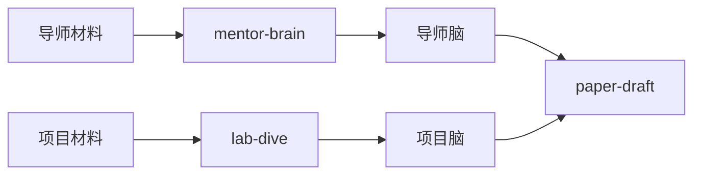
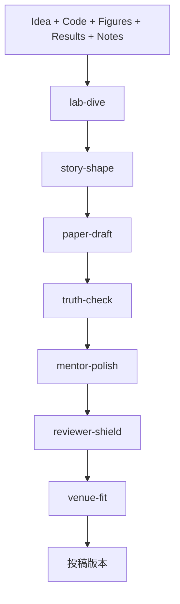
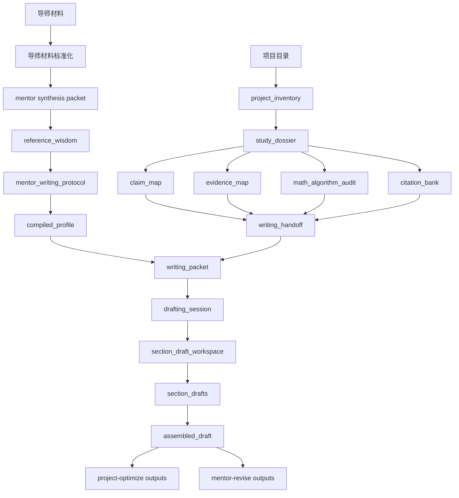

# Codex Paper Skills v0.0.1 总体架构设计

状态：候选架构冻结稿
读者：项目负责人、Codex 使用者、后续实现者
范围：仅定义架构；本文件的目标是在继续加功能之前，先把主要工作流边界冻结下来

---

## 1. 为什么必须先写这份文档

仓库现在已经有不少有价值的能力，但当前最大的风险已经不是“功能不够多”，而是“架构继续漂”。

系统现在必须停止横向长功能，转而收敛成一个清晰、稳定、可演进的操作系统。

这份文档就是为了定义这个操作系统。

目标并不只是做一个 AI 写论文工具，而是要做成一个：

> **导师引导、项目感知、教授级判断的 Codex 学术写作操作系统**。

这意味着系统必须同时做到：

1. 从导师材料中学习导师智慧；
2. 把当前研究项目本身研究透；
3. 把导师脑与项目脑汇合成真正可写作的 handoff；
4. 在导师式润色之前，先做科学正确性优化；
5. 用可检查、可追踪的 artifact 维持整个系统的透明性；
6. 让 skill 永远做指导者，而不是偷偷变成脚本黑箱执行器。

---

## 1A. 当前范围冻结：只服务 PolyU AAE IPNL

对于 v0.0.1，这个项目**不是**一个通用学术写作系统。

它应该被明确理解为：只服务于 **香港理工大学（PolyU）航空及民航工程学系（AAE）智能定位与导航实验室（IPNL）** 当前研究领域的实验室级写作操作系统。

### 为什么这点重要

架构必须围绕真实实验室领域来设计，而不是过早假装自己已经 domain-general。

### 官方实验室背景里明确对齐的方向

根据 PolyU AAE IPNL 官网和相关 faculty 页面，实验室及其研究线当前重点包括：

- intelligent positioning and navigation，
- GNSS positioning and signal processing，
- multi-sensor integration，
- autonomous driving 与 UAV 相关导航，
- indoor positioning，
- smart mobility 与 smart-city positioning，
- visual / LiDAR SLAM，
- estimation and optimization，
- positioning integrity 与 reliability。

因此，当前产品范围应该明确冻结在以下方向：

- GNSS，
- integrated navigation，
- factor graph optimization，
- uncertainty / integrity / credibility，
- sensor fusion，
- SLAM 邻域的定位与导航问题，
- 服务于上述定位导航问题的 AI / deep learning 方法。

这并不否认未来扩展，但 v0.0.1 不允许提前泛化。

---

## 1B. 面向用户的命名刷新建议

当前 repo / package 名称有历史价值，但不是最清晰的用户侧名称。

对于架构设计和未来操作体验，我建议新的产品级名称是：

- **产品名：** `IPNL Paper Pilot`
- **当前兼容别名：** `codex-paper-skills`、`codex-paper-forge`

`Paper Pilot` 这个名字更轻、更好记，也和 AAE / 导航语境更贴合。

---

## 2. 不可妥协的设计原则

### 2.1 skill 是指导者，Codex 才是执行者

这个 package 里的每个 skill 都只是指导面，不是实际干活的人。

- **skill**：定义流程、门控、done criteria、handoff 关系；
- **Codex / agents**：做真正的研究、判断、写作、改稿；
- **script**：做稳定、可复现、可验证的支架与工位。

这个项目存在的意义，是鞭策 Codex 做得更对、更细、更像导师，而不是让脚本代替 Codex 思考。

### 2.2 导师脑和项目脑必须分离

系统必须有两个不同的大脑：

- **导师脑（Mentor Brain）**：导师怎么写、怎么收、怎么改、怎么判断；
- **项目脑（Project Brain）**：当前项目到底证明了什么、缺什么、该怎么讲、该引什么。

这两个脑一旦混在一起，系统很快就会变脏、变乱、变弱。

### 2.3 当前草稿永远不能污染导师学习

当前正在写、正在改的论文草稿，是系统的目标对象，绝对不是导师智慧来源。

这是一条硬性 guardrail。

### 2.4 科学正确性优先于导师式 polish

一篇写得很像导师、但科学上站不住的论文，仍然是弱论文。

所以流程必须强制：

1. 先研究透项目；
2. 再完成写作；
3. 再做 scientific optimization；
4. 最后才做导师级润色。

### 2.5 先证据，后优雅

系统必须优先偏向：

- 证据，而不是流畅感；
- 明确支持，而不是漂亮 bluff；
- 可验证的 claim，而不是“听起来很强”的句子；
- comparator 点名，而不是模糊 improvement；
- 诚实 scope，而不是膨胀 conclusion。

### 2.6 架构必须可检查、可排障、可追责

每个重要阶段都必须产出清晰可读的 artifact。

这是为了：

- debug，
- version tracking，
- 质量审查，
- skill 迭代，
- 后续 agent 路由与演进。

---

## 3. “卓越研究教授级”目标能力

真正优秀的教授，强的绝不只是句子润色。

系统最终要逼近的是下面这些教授级能力：

| 能力 | 为什么重要 | 主要归属 lane |
|---|---|---|
| 导师写作智慧 | 让 Codex 写得和改得越来越像导师 | `mentor-brain` |
| 深度项目理解 | 防止写作脱离真实研究内容 | `lab-dive` |
| framing / positioning | 选择最强 paper angle 和 scientific gap | `story-shape` |
| 研究价值排序 | 决定什么该进主文、什么只是 filler | `lab-dive` + `story-shape` |
| 数学 / 算法严谨性 | 保护公式、符号、理论和 method 的真实性 | `lab-dive` + `truth-check` |
| 引文策略 | 保证文献真实、高质量、放在该放的位置 | `lab-dive` + `story-shape` |
| claim / evidence 对齐 | 防止 overclaim 和论证链断裂 | `truth-check` |
| 导师级表达润色 | 达到导师层次的局部写作质量 | `mentor-polish` |
| reviewer 攻防意识 | 提前发现审稿人最容易攻击的地方 | `reviewer-shield` |
| 学生救援 / 卡点诊断 | 判断到底该补实验、改 story，还是继续写 | `lab-dive` + `story-shape` |
| scope control | 决定这篇 paper 该讲多大、哪些内容应留后手 | `story-shape` |

当前仓库只部分进入了这些区域；v0.0.1 必须把这些职责显式写进框架，而不是留在脑补里。

---

## 3A. 可以借鉴的教授级 / 顶级技术研究者写作指导

这个 pipeline 不应该只靠我们自己的直觉设计，而应该主动借鉴那些已经影响过大量科研写作者的高质量写作指导。

### 来源 1：George M. Whitesides（哈佛化学）—— *Writing a Paper*

可以借鉴的原则：

- 写作不是研究结束后的附属动作，而是研究过程本身的一部分；
- paper 应该尽早 outline，以便反过来决定还缺哪些实验；
- introduction 必须回答“为什么重要”，而不是只说“做了什么”；
- paper 要围绕读者真正需要的信息来组织。

可转进 pipeline 的点：

- `lab-dive` 必须在 `paper-draft` 之前找出还缺哪些 evidence；
- `story-shape` 必须强制把 “why this matters” 写出来；
- `truth-check` 应该检查当前 experiments 是否真的足够支撑选定的故事线。

### 来源 2：Donald Knuth（Stanford 计算机科学）—— 技术写作 / 数学写作指导

可以借鉴的原则：

- 数学符号和 prose 必须协同工作，而不是互相打架；
- algorithm explanation 是 technical communication 的一部分，而不是装饰；
- 高质量 revision 常常来自无情澄清，而不是只做压缩；
- 例子、图表、notation discipline 对 technical readability 有决定性影响。

可转进 pipeline 的点：

- `math_algorithm_audit` 必须成为一等 artifact；
- `paper-draft` 必须把 notation、figure、algorithm description 当作一个整体沟通系统；
- `mentor-polish` 在修句子时不能破坏数学真值。

### 来源 3：Simon Peyton Jones —— *How to Write a Great Research Paper*

可以借鉴的原则：

- 一篇 paper 应该有一个最清楚的中心贡献；
- paper 应该讲 story，而不是 dump results；
- title 和 abstract 是对读者的 contract；
- rewrite 和 reviewer feedback 都是论文流程的正常阶段。

可转进 pipeline 的点：

- `story-shape` 必须选出单一最强 paper angle；
- `paper-draft` 必须逐节保持 story coherence；
- `reviewer-shield` 不应该是事后补丁，而应该是架构里有名有姓的一条线。

### 来源 4：Kristin Sainani（Stanford）—— scientific writing / publication guidance

可以借鉴的原则：

- 大量 low-information clutter 应该被主动删掉；
- paragraph structure 和 sentence correctness 一样重要；
- figures / tables 应该诚实直接地呈现数据；
- writing、revision 和 publication strategy 应该被当成一条连续工作流。

可转进 pipeline 的点：

- `mentor-polish` 必须显式清理 AI-smooth 但低信息密度的 prose；
- `paper-xray` 应该检查 tables / figures 是否诚实表达数据；
- `truth-check` 和 `mentor-polish` 必须分离但连续。

### 从这些来源抽出来的架构规则

这个 package 不应该只是“生成文本”，而应该内化以下五条：

1. 尽早形成研究感知式大纲，
2. 强制单一主故事线，
3. 强化 notation / algorithm rigor，
4. 强调 honest evidence communication，
5. 把 heavy revision 当作正常流程，而不是最后抢救。

---

## 4. 规范的 lane 拆分

整个系统应该明确为：**七条主线 + 三条辅助线**。

---

### 4.1 主线：`mentor-brain`

推荐未来用户侧名称：`mentor-brain`
兼容别名：`$learning`、`mentor-learning`

#### 使命
只从导师材料中学习导师智慧。

#### 输入
- 导师 PDF
- 导师录音文字稿
- transcript JSON
- revision traces / rewrite examples
- 与导师研究线一致的高质量 reference papers

#### 输出
- normalized mentor materials
- mentor synthesis packet
- `reference_wisdom`
- `mentor_writing_protocol`
- `compiled_profile`

#### 它回答的问题
- 导师怎么写？
- 导师怎么组织 section / paragraph？
- 导师拒绝哪些表达？
- 导师怎么 tighten 和 revise？

#### 它绝对不该做的事
- 不研究当前项目；
- 不写当前论文；
- 不把当前草稿当成导师样本。

---

### 4.2 主线：`lab-dive`

推荐未来用户侧名称：`lab-dive`
兼容别名：`$studying`

#### 使命
把当前研究项目研究透，并压成一个 paper-ready knowledge package。

#### 输入
- 当前项目目录
- code
- figures
- result files
- logs
- notes / idea 文档
- 可选外部 literature retrieval outputs
- mentor brain（仅作辅助手段，不替代 project understanding）

#### 输出
- `project_inventory`
- `study_dossier`
- `claim_map`
- `evidence_map`
- `math_algorithm_audit`
- `citation_bank`
- `writing_handoff`
- `studying_summary`

#### 它回答的问题
- 这个项目到底解决什么问题？
- strongest claim 是什么？ weakest claim 是什么？
- 哪些 evidence 应该进 main text，哪些只是 appendix 或 filler？
- 哪些数学、算法、理论点必须核验？
- 哪些真实文献必须被引用？

#### 它绝对不该做的事
- 在 handoff 不可信时直接开写；
- 捏造 evidence；
- 捏造 citation；
- 用导师风格替代项目理解。

---

### 4.3 主线：`story-shape`

推荐未来用户侧名称：`story-shape`
兼容别名：`framing`

#### 使命
把项目理解转成最强的 paper story、贡献层级和 scope 边界。

#### 输入
- `study_dossier`
- `claim_map`
- `evidence_map`
- `citation_bank`
- mentor brain

#### 输出
- framing memo
- paper angle candidates
- contribution hierarchy
- novelty / scope statement
- title candidates
- abstract framing options
- overclaim / weak novelty 风险清单

#### 它回答的问题
- 这篇 paper 最强的科学 framing 是什么？
- 哪个贡献该打在最前面？
- 哪些不该说？
- 哪些内容该留到下一篇？
- 哪种 framing 最抗 reviewer 打击？

#### 它绝对不该做的事
- 替代 studying 的 rigor；
- 变成空泛 brainstorming memo；
- 越过结构规划直接开始 prose。

---

### 4.4 主线：`paper-draft`

推荐未来用户侧名称：`paper-draft`
兼容别名：`drafting`、`$gnss-paper-write`

#### 使命
用导师脑 + 项目脑，把论文逐层写出来。

#### 输入
- mentor brain
- writing handoff
- framing memo
- venue profile（可选）

#### 输出
- outline
- skeleton
- paragraph plan
- sentence plan
- writing packet
- drafting session
- section draft workspace
- section drafts
- assembled draft

#### 它回答的问题
- 论文整体结构怎么搭？
- 每一节做什么？
- 每一段做什么？
- 每类句群应该怎么推进，才能既稳又像导师？

#### 它绝对不该做的事
- 重新定义 framing；
- 在证据不足时自由发挥；
- 用漂亮句子掩盖 unsupported claim。

---

### 4.5 主线：`truth-check`

推荐未来用户侧名称：`truth-check`
兼容别名：`project-optimize`

#### 使命
用项目脑把“已经差不多写完”的论文修到科学上站得住。

#### 输入
- 成熟或半成熟 draft
- study dossier
- claim map
- evidence map
- math/algorithm audit
- citation bank

#### 输出
- scientific issue report
- claim/evidence correction packet
- citation repair plan
- math/algorithm correction notes
- project-level rewrite plan

#### 它回答的问题
- 这篇稿子说的东西，项目真的能支撑吗？
- 数学和算法写严谨了吗？
- 该有的引文全吗，位置对吗？
- 哪些 paragraph 虽然流畅，但科学上其实很弱？

#### 它绝对不该做的事
- 把局部 polish 当成 scientific fix；
- 取代导师式 revision；
- 让 unsupported claim 因为“语气更保守”就被放过。

---

### 4.6 主线：`mentor-polish`

推荐未来用户侧名称：`mentor-polish`
兼容别名：`mentor-revise`

#### 使命
把一篇科学上已经基本可信的稿子，往导师级写作质量上拉满。

#### 输入
- mature draft
- mentor brain
- mentor writing protocol

#### 输出
- mentor revision packet
- sentence-level polish notes
- paragraph-level mentor rewrite notes
- transition / rhythm fixes
- final mentor-style refinement plan

#### 它回答的问题
- 如果导师亲自改，这句话会怎么改？
- 哪些 paragraph 节奏不对？
- 哪些 transition 太生硬、太 AI？
- 哪些局部 wording / tone 必须改到导师水准？

#### 它绝对不该做的事
- 取代项目正确性修复；
- 让科学上站不住的稿子仅靠 polish 就“看起来没问题”。

---

### 4.7 主线：`reviewer-shield`

推荐未来用户侧名称：`reviewer-shield`
兼容别名：`reviewer-sim`

#### 使命
在投稿前模拟 reviewer 攻击面。

#### 输入
- framed paper plan 或 mature draft
- claim/evidence/citation artifacts
- venue profile

#### 输出
- reviewer attack-surface memo
- likely major concerns
- missing baseline warnings
- novelty vulnerability notes
- likely-reject reasons and countermeasures

#### 它回答的问题
- reviewer 最先会打哪里？
- 哪些 claim 最危险？
- 哪些 baselines / references 没补会很致命？
- 哪些补实验或降 claim 最能提升生存率？

#### 它绝对不该做的事
- 取代 project optimization；
- 变成 generic negativity engine；
- 脱离证据乱猜 reviewer 需求。

---

## 5. 辅助线

### 5.1 `paper-xray`
一个综合诊断 surface，负责汇总 analyzer 结果和 issue packaging。
兼容别名：`paper-report`

### 5.2 `reference-mirror`
把 draft 和强参考论文做镜像对照，尤其适合 paragraph job / sentence move 的差距分析。
兼容别名：`reference-align`

### 5.3 `venue-fit`
一个 venue constraint layer，负责把论文对齐到具体会议/期刊的 presentation 规则上。
兼容别名：`venue-adapt`

这些都重要，但它们不是核心作者工作流本身。

---

## 6. 双脑模型

### 6.1 导师脑包含什么
- mentor reference wisdom
- mentor writing protocol
- section / paragraph decision policies
- local language guardrails
- mentor revision heuristics

### 6.2 项目脑包含什么
- 项目资产 inventory
- 项目层 claim/evidence 结构
- math/algorithm audit
- citation strategy 与 citation bank
- framing constraints 与 writing handoff

### 6.3 为什么必须双脑
没有导师脑，写出来可能正确，但不像导师。

没有项目脑，写出来可能很好看，但本质上没把研究看懂。

系统必须同时有两者。

---

## 7. 单篇论文的完整生命周期

### 顺序为什么这样排
1. **先 study**，保证看懂项目；
2. **再 framing**，保证讲对故事；
3. **再 drafting**，保证 prose 有据可依；
4. **先 scientific optimize** 再 polish；
5. **再 mentor revise**，提升导师级质量；
6. **submission 前 reviewer-sim**；
7. **最后 venue-adapt**。

---

## 8. Artifact 流转图

---

## 9. skill / agent / script 的职责边界

这块是系统最核心的结构边界之一。

### 9.1 skill
skill 是**流程与治理层**。

它应该定义：
- 什么时候用这个 lane；
- 输入输出是什么；
- guardrail 是什么；
- 什么叫 done；
- 下一步应该 handoff 给谁。

skill 不应该变成隐藏的“自动黑箱工人”。

### 9.2 agent / Codex
agent 是真正的研究者、写作者和修订者。

它应该负责：
- mentor synthesis，
- 项目理解，
- framing judgment，
- citation choice，
- section drafting，
- scientific rewrite decisions，
- reviewer simulation。

### 9.3 script
script 是稳定工位和支架层。

它应该负责：
- normalization，
- inventory generation，
- packet export，
- artifact serialization，
- deterministic checks，
- pipeline orchestration，
- install / doctor / docs validation。

### 9.4 分工矩阵

| 任务 | Skill | Agent/Codex | Script |
|---|---|---|---|
| 导师 PDF ingestion | 路由和 guardrails | 否 | 是 |
| 导师智慧蒸馏 | guardrails | 是 | 只做支撑 |
| 项目目录 inventory | artifact contract | 否 | 是 |
| strongest claim 判断 | guardrails | 是 | 只定义 artifact shape |
| citation 筛选与 why-cite | verification rules | 是 | 存储与序列化 |
| outline 生成 | workflow rules | 是 | 可选导出 |
| sentence plan 生成 | workflow rules | 是 | 可选导出 |
| workspace 导出 | 否 | 否 | 是 |
| scientific issue 排序 | policy | 是 | 可选汇总 |
| 导师级润色 | policy | 是 | 只做 packetization |
| install / doctor / doc checks | 否 | 否 | 是 |

---

## 10. 规范命名体系

当前仓库里有一些历史命名，把 domain、lane、历史实现习惯混在了一起。

v0.0.1 之后应该朝下面的命名体系收敛。

### 10.1 未来用户侧主线名称

| 友好名称 | 当前 / 兼容别名 | 作用 |
|---|---|---|
| `mentor-brain` | `learning`、`mentor-learning` | 导师脑学习与蒸馏 |
| `lab-dive` | `studying` | 当前项目研究 |
| `story-shape` | `framing` | story 选择与 scope control |
| `paper-draft` | `drafting`、`gnss-paper-write` | 从导师脑 + 项目脑真正写稿 |
| `truth-check` | `project-optimize`、与 `gnss-paper-optimize` 部分重叠 | scientific correctness 优化 |
| `mentor-polish` | `mentor-revise`、与 `gnss-paper-optimize` 部分重叠 | 导师级润色 |
| `reviewer-shield` | `reviewer-sim` | submission 前 reviewer 攻防模拟 |

### 10.2 辅助线命名

| 友好辅助名 | 当前 / 兼容别名 |
|---|---|
| `paper-xray` |
| `reference-mirror` |
| `venue-fit` |

### 10.3 命名原则

- 名称应该短、直观、好记，还可以稍微有一点趣味；
- 兼容别名在迁移期必须继续保留；
- domain-specific 名称可以保留为兼容 alias；
- 任何 lane 不应该因为历史方便，就继续承担两种完全不同的职责。

---

## 11. 哪些模块能独立使用，哪些不能

不是每条 lane 都应该被当成独立入口。

系统必须明确区分：

- **可以独立成立的 lane**；
- **技术上能单跑，但没有上游时质量会明显下降的 lane**；
- **原则上不该直接独立调用的依赖型 lane**。

### 11.1 独立使用矩阵

| Lane | 能否独立使用 | 为什么 | 最低输入 |
|---|---|---|---|
| `mentor-brain` | **可以** | 它只处理导师/reference 材料，不依赖当前项目 | mentor/reference materials |
| `lab-dive` | **可以** | 它是项目侧第一条主线，必须能独立起跑 | project directory |
| `story-shape` | **原则上不可以** | 它应该建立在 study artifacts 上，而不是直接面对原始项目噪声 | study dossier + claim/evidence/citation artifacts |
| `paper-draft` | **条件性可以** | demo/兼容模式下可以从 spec + mentor bundle 起步，但规范模式应吃 story-shape + writing handoff | mentor brain + writing handoff（最好再加 story-shape memo） |
| `truth-check` | **条件性可以** | 没有 project brain 也能看 draft，但效果会明显变弱 | mature draft + project brain |
| `mentor-polish` | **可以，但前提是稿子已经基本成熟** | 它能独立做导师式 polish，但不该拿来修 scientific weakness | mature draft + mentor brain |
| `reviewer-shield` | **条件性可以** | 可以对 framed plan 或 mature draft 做预演，但最好建立在 truth-check 之后 | framed plan 或 mature draft |
| `paper-xray` | **可以** | 它本来就是综合诊断 surface | draft |
| `reference-mirror` | **可以** | 它做的是 draft 段落与 reference library 的镜像比较 | draft section + reference library |
| `venue-fit` | **可以** | 它只需要稿子和 venue profile | draft + venue profile |

### 11.2 硬依赖规则

下面这些应该被当成架构硬规则，而不是“建议最好这样”：

1. `story-shape` 不能直接绕过 `lab-dive` 对原始项目文件开跑；
2. `paper-draft` 如果跳过 `lab-dive`，只能被视为兼容模式，不能自称规范工作流；
3. 在 scientific correctness 还没稳住之前，`mentor-polish` 不能拿来替代 `truth-check`；
4. `mentor-brain` 永远不能吃当前项目草稿。

### 11.3 推荐依赖顺序

| 上游 | 下游 | 关系 |
|---|---|---|
| `mentor-brain` | `paper-draft` | 导师脑依赖 |
| `lab-dive` | `story-shape` | 项目理解硬依赖 |
| `story-shape` | `paper-draft` | 规范 story 依赖 |
| `paper-draft` | `truth-check` | draft 依赖 |
| `truth-check` | `mentor-polish` | 推荐质量依赖 |
| `mentor-polish` | `reviewer-shield` | 推荐投稿前依赖 |
| `reviewer-shield` | `venue-fit` | 推荐最终提交顺序 |

### 11.4 兼容模式 vs 规范模式

当前系统里有一些历史入口还允许跳过理想上游流程。

这不是不能接受，但必须**显式说明**：

- **规范模式（Canonical mode）**：遵守完整架构；
- **兼容模式（Compatibility mode）**：为 demo、迁移、smoke test 保留的降级输入模式。

例如：

- `gnss-paper-write` / `paper-draft` 直接从 `spec.json + mentor bundle` 起跑，是**兼容模式**；
- `paper-draft` 从 `mentor brain + writing handoff + story-shape memo` 起跑，才是**规范模式**。

---

## 12. 各 lane 的内部模块

### 12.1 `mentor-brain` 内部模块
- mentor material ingestion
- mentor material normalization
- mentor synthesis packet export
- Codex-led mentor protocol synthesis
- mentor bundle merge

### 12.2 `lab-dive` 内部模块
- project inventory
- research dossier
- claim map
- evidence map
- math/algorithm audit
- citation bank
- writing handoff

### 12.3 `story-shape` 内部模块
- contribution ranking
- paper-angle comparison
- title/abstract framing candidates
- scope control memo
- reviewer-sensitive novelty framing

### 12.4 `paper-draft` 内部模块
- outline builder
- skeleton builder
- paragraph planner
- sentence planner
- writing packet
- drafting session
- workspace exporter
- section drafting loop
- assembled draft builder

### 12.5 `truth-check` 内部模块
- claim/evidence mismatch detection
- math/algorithm inconsistency detection
- citation weakness detection
- scientific rewrite planning

### 12.6 `mentor-polish` 内部模块
- sentence polish planner
- paragraph rhythm planner
- transition repair planner
- tone and terminology alignment

### 12.7 `reviewer-shield` 内部模块
- missing baseline detector
- novelty attack predictor
- weak-scope detector
- likely-reviewer-objection memo

---

## 13. 硬性 guardrails

系统架构必须显式写死这些 guardrails：

1. **当前草稿永远不能进入 mentor-brain 学习。**
2. **没有可信的 lab-dive + story-shape handoff，paper-draft 不能自称规范工作流。**
3. **没有 evidence 对齐的 claim 不能放过。**
4. **没有真实、可验证来源的 citation 不能进入 citation bank。**
5. **数学和算法相关表述必须有 checked / unchecked 标记。**
6. **mentor-polish 不能用来掩盖 scientific weakness。**
7. **script 可以做支架，但不能冒充真正的智力执行者。**
8. **每条 lane 都必须输出可检查的 artifact，而不是只有隐形内部状态。**

---

## 14. v0.0.1 冻结范围

系统现在需要一个版本冻结，不然会继续无边界扩张。

## 14A. 由真实用户痛点决定的 P0 优先级

这个项目的起点本身就应该进入架构决策：

当前最直接的痛点**不是**“完全不会从零生成论文”，而是：

- 已经有一篇写得差不多的论文；
- 导师反复指出论文有人机味、AI 味、写作问题很多；
- 改稿过程非常痛苦、重复、低效；
- 用户最需要的是先把这种“接近完成但写得不像导师”的稿子救出来。

因此，架构必须明确把 **基于导师脑的检查、诊断、润色、修改** 设为 P0。

### P0 集群

最先必须做成真正可用的，应该是下面这组：

1. `mentor-brain` —— 干净地学习并存储导师智慧；
2. `paper-xray` —— 检测 mentor-drift、AI 味、弱 transition、模糊 phrasing、局部写作问题；
3. `reference-mirror` —— 用强参考段落照弱段落；
4. `mentor-polish` —— 对接近完成的稿子逐句逐段往导师质量上拉。

### 为什么这是 P0

因为这是从用户当前真实痛点到“马上能测、马上能用”的最短路径。

更完整的 canonical pipeline 仍然重要，但 v0.0.1 首先必须把“我已经有一篇写得差不多但很痛苦的稿子”这个场景服务好。

### 14.1 v0.0.1 必须包含的内容

#### 必须完成的导师脑主线
- `mentor-brain` / `learning`：mentor ingestion、mentor synthesis packet、reference wisdom、mentor writing protocol、compiled profile

#### 必须完成的项目脑主线
- `lab-dive` / `studying`：inventory、dossier、claim map、evidence map、citation bank、writing handoff
- 第一版 `math_algorithm_audit` artifact，即使一开始还偏保守

#### 必须完成的写作主线
- `story-shape` 第一版 artifact
- writing packet
- drafting session
- section-draft workspace
- sentence-plan surface 或 sentence-level playbook injection
- assembled draft pathway

#### 必须完成的 post-draft 主线
- 第一版 `truth-check`
- 第一版 `mentor-polish`

#### 必须完成的治理与支撑
- docs / install / doctor 完整性
- practical schemas
- studying 和 drafting 的 pipeline summaries

### 14.2 明确不属于 v0.0.1 的内容
- 任意 session 的全自动后台持续学习；
- 多导师混合；
- GNSS/navigation 之外的全面 domain-general 写论文；
- 完全成熟的 reviewer-sim；
- 没有 artifact 的黑盒自动化；
- GUI-first 产品化。

---

## 15. 当前仓库与目标架构的映射

### 已经比较实在地存在的部分
- mentor material ingestion
- mentor/reference wisdom distillation
- mentor writing protocol
- studying inventory 和 dossier 雏形
- claim/evidence/citation/handoff 雏形
- writing packet
- drafting session
- section-draft workspace
- paper report 与 optimize scaffolding

### 已存在但仍然混杂或不完整的部分
- `gnss-paper-optimize` 目前仍混有 `truth-check` 和 `mentor-polish` 两类修订逻辑；
- `lab-dive` / `studying` 已有 citation bank surface，但还没有完整 40 篇 verified references；
- math/algorithm audit 在架构上已经被要求，但 artifact 还不够一等公民；
- `paper-draft` 现在已经有 workspace guidance，但真正的 Codex section-writing loop 还未完全打透。

### 目前仍然不够显式的部分
- `story-shape`
- `reviewer-shield`
- student rescue / bottleneck diagnosis
- 作为独立 artifact 的 scope-control memo

---

## 16. 架构批准后的推荐实现顺序

1. **先把 `mentor-brain` / `learning` 稳定成导师专用 lane。**
2. **补完整 `lab-dive` / `studying`，尤其是 `math_algorithm_audit` 与更完整的 citation curation workflow。**
3. **在继续扩大 drafting 自动化之前，先把 `story-shape` 做成显式 artifact。**
4. **让 `paper-draft` 真正直接吃 `lab-dive + story-shape` handoff。**
5. **把 `gnss-paper-optimize` 正式拆成 `truth-check` 与 `mentor-polish`。**
6. **等核心生命周期稳定后，再上 `reviewer-shield`。**

---

## 17. 最终架构宣言

这个 package 不能再被理解成一堆论文脚本。

它应该被理解成：

> 一个导师引导、项目感知、artifact 驱动的 Codex 学术写作操作系统；
> skill 负责定规则，
> Codex 负责做真正的智力工作，
> script 负责提供稳定、可检查、可复现的支架。

这才是这个仓库从现在开始应该有意识地去建设的架构，而不是靠偶然堆出来的形态。

---

## 18. 这次精细化设计参考的外部链接

### PolyU / IPNL 背景
- PolyU AAE IPN Lab 主页：`https://www.polyu.edu.hk/aae/ipn-lab/us/index.html`
- PolyU AAE IPN Lab research areas：`https://www.polyu.edu.hk/aae/ipn-lab/us/research-area/ra_intro.html`
- PolyU AAE faculty 页面（Prof. Li-Ta Hsu）：`https://www.polyu.edu.hk/aae/people/academic-staff/prof-li-ta-hsu/`

### 顶级教授 / 技术研究者写作指导
- George M. Whitesides, *Writing a Paper*：`https://www.epfl.ch/labs/lsci/wp-content/uploads/2023/01/Whitesides-ACS-Writing-a-Scientific-Paper.pdf`
- Donald Knuth technical and mathematical writing page：`https://cs.stanford.edu/~knuth/klr.html`
- Simon Peyton Jones, *How to Write a Great Research Paper*：`https://www.microsoft.com/en-us/research/uploads/prod/2016/07/How-to-write-a-great-research-paper.pdf`
- Kristin Sainani, Stanford *Writing in the Sciences*：`https://online.stanford.edu/courses/som-y0010-writing-sciences`
